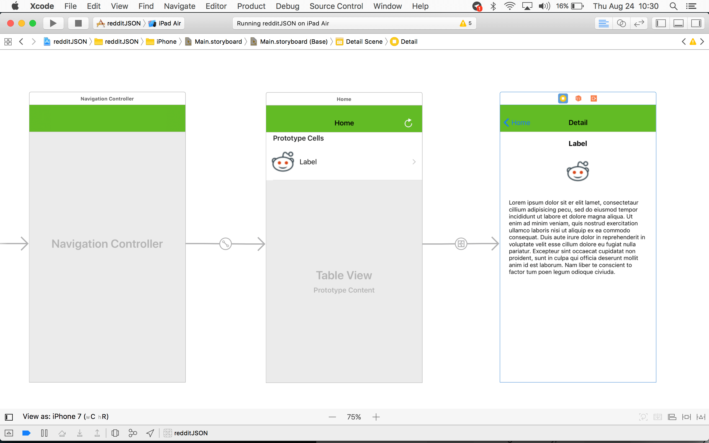
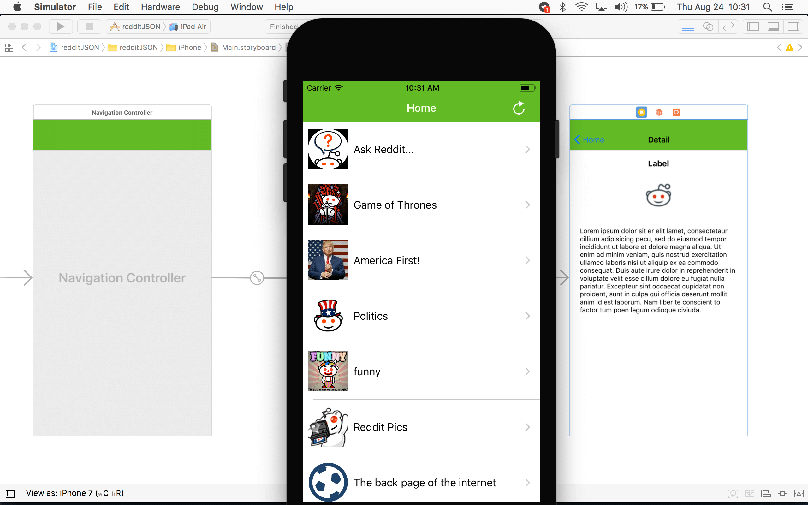
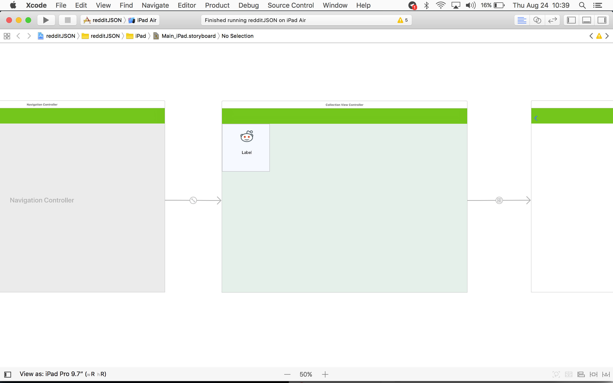
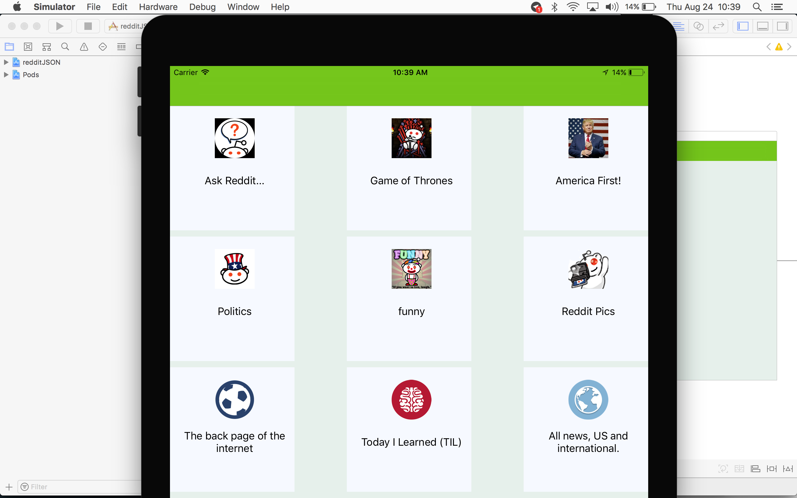

RedditJSON

### Caracteristicas de la APP
- Consumo de API REST https://www.reddit.com/reddits.json
- Detecta si hay conexión a internet e intenta consumir API
- Guarda en Core Data los datos del API REST
- Descarga en background las imagines utilizadas
- utiliza 2 storyboard (iPhone, iPad) de acuerdo al dispositivo utiliza el indicado
- TableViewController para iPhone
- CollectionViewController para iPad

### Librerias utilizadas (cocoapods)

- Alamofire -> Consumo de API REST
- SCLAlertView -> Mostrar Mensajes
- MBProgressHUD -> Animación de Progreso
- SwiftyJSON -> Parsear los datos del API

### Screenshot iPhone

### Screenshot iPad

